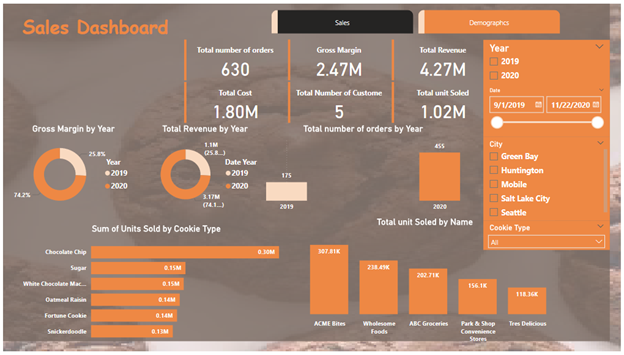
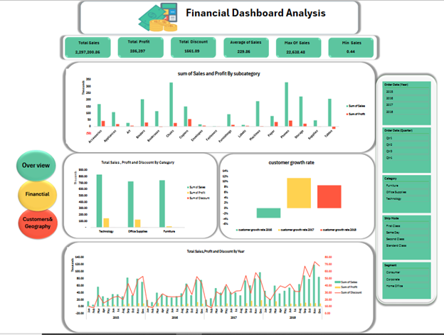
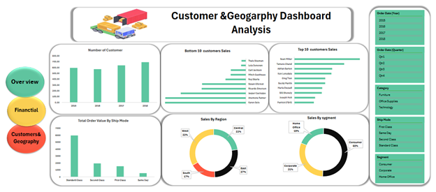

# 📊 Excel Data Analysis: Sales Report Project

Welcome to the **Sales Report Analysis** project! This project analyzes sales data from three product categories: **Technology**, **Furniture**, and **Office Supplies**. We use **Excel** to build dynamic reports and visualize insights on sales trends, customer behavior, and shipping performance. The analysis integrates multiple tables: **Orders**, **Dim Customer**, **Products**, **Ship Mode**, **Dim Date**, and a **Model Table**.

---

## 📝 Project Overview

The goal of this project is to explore and analyze sales data, providing valuable business insights. We use Excel tools such as pivot tables, charts, and data models to examine key metrics like revenue, product sales performance, and customer segmentation. The report focuses on product categories: **Technology**, **Furniture**, and **Office Supplies**.

### Key Objectives:
- Analyze sales performance across multiple product categories.
- Understand customer demographics and purchasing behaviors.
- Identify top-selling products and evaluate revenue growth.
- Assess shipping modes and their efficiency.
## 📊 Visuals & Dashboards

### 1. **Sales Dashboard** 📊
- **Total Sales by Product Category** 💼: Compare sales of **Technology**, **Furniture**, and **Office Supplies**.
- **Sales Trends** 📅: Monthly and quarterly sales breakdown over time.
- **Top-Selling Products** 🥇: Highlights the highest revenue-generating products.

### 2. **Financial Dashboard** 💵
- **Revenue, Profit, and Discounts** 📉: Analyze the relationship between revenue and discount rates.
- **Profit by Product Category** 💼: Shows profitability across **Technology**, **Furniture**, and **Office Supplies**.
- **Discount Impact on Sales** 🔍: Evaluate how discount rates affect total sales and profit margins.

### 3. **Customer & Geographic Dashboard** 🌍
- **Customer Segmentation** 👥: Visualize customers by segment (e.g., Corporate, Small Business).
- **Sales by Region** 📍: A heatmap displaying sales performance across different geographic locations.
- **Top Customers by Revenue** 🏆: Lists the top revenue-generating customers.
---

## 📊 Visuals & Reports

### 1. **Sales Overview**
- **Total Sales by Year** 📅: Year-over-year revenue comparison for all categories.
- **Revenue by Product Category** 💼: A breakdown of sales for **Technology**, **Furniture**, and **Office Supplies**.
- **Sales by Ship Mode** 🚚: Analyzes shipping performance for different methods, highlighting cost and speed efficiencies.

### 2. **Customer Insights**
- **Customer Segmentation** 👥: Groups customers by region, buying habits, and segment (e.g., Corporate, Small Business, etc.).
- **Sales by Customer Region** 🌍: A heatmap showing sales distribution across geographic locations.
  
### 3. **Product Analysis**
- **Top-Selling Products** 🥇: Ranks products based on sales volume within each category.
- **Product Sales Trends** 📉: Visualizes how each product category has performed over time.

### 4. **Order & Shipping Analysis**
- **Order Frequency by Segment** 🔄: Shows repeat orders from different customer segments.
- **Shipping Mode Efficiency** ⏱️: Compares shipping times and costs across different ship modes.

---

## 🗂️ Data Model Overview

The project uses a **Star Schema** with dimension tables and a fact table to create clear, structured data relationships.

### **1. Orders Table** 📦
- Order ID
- Customer ID
- Product ID
- Ship Mode ID
- Order Date
- Sales
- Quantity
- Discount
- Profit

### **2. Dim Customer Table** 👥
- Customer ID
- Customer Name
- Customer Segment (e.g., Corporate, Small Business)
- City
- State
- Region

### **3. Products Table** 🛍️
- Product ID
- Product Name
- Category (Technology, Furniture, Office Supplies)
- Sub-Category
- Price

### **4. Ship Mode Table** 🚚
- Ship Mode ID
- Ship Mode Name (e.g., Standard, Express, Same-Day)

### **5. Dim Date Table** 📅
- Date ID
- Date
- Month
- Quarter
- Year

### **6. Model Table** 🔗
- Manages relationships between the fact and dimension tables.

---

## ⚙️ Tools Used

- **Excel** 📊: For clean and transform raw data into usable tables, creating pivot tables, charts,establish relationships between the Orders, Customers, Products, Ship Mode,                 and Date tables and performing data analysis.
---

## 📸 Demo

Here are some screenshots of the **Excel** sales report:

### Sales Dashboard

### Financial Dashboard

### Customer & Geographic Dashboard

